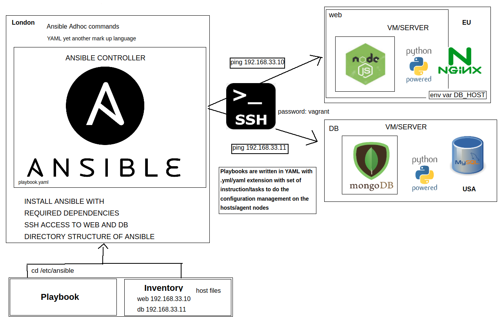
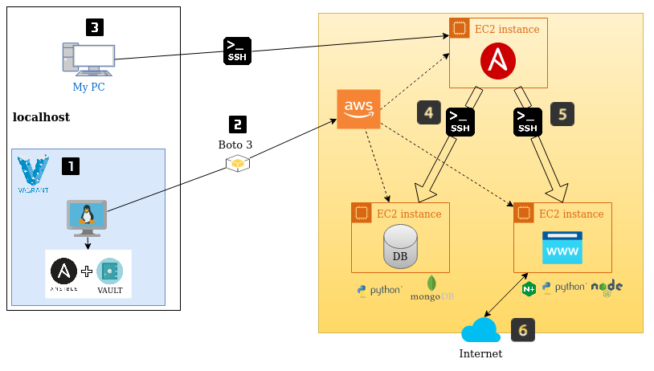

# Ansible Task

### Task



Use ansible playbooks to launch 3 machines on AWS: a controller, a web-app and a database. Implement the 2 tier architecture as IaC with ansible. Node app has to work with public IP and db working with /posts.

### Solution

__Steps__:



__1: We are going to run our virtual machine with vagrant, which we are going to use as a controller only to launch the three instances in AWS.__

- Let's run `vagrant up`. We have the Vagrantfile ready. It is available in this repository.

- Connect into the machine: `vagrant ssh controller`

- Run the followings commands to install ansible:

````
sudo apt-get upgrade -y

sudo apt-get update -y

sudo apt-get install software-properties-common -y

sudo apt-add-repository ppa:ansible/ansible -y

sudo apt-get update -y

sudo apt-get install ansible -y

sudo apt-get install tree -y
````

- Check if ansible was installed: `ansible --version`

- Let's configure our vagrant vault which will help us connect to AWS to create the machines.. Run the following commands:

````
sudo apt-add-repository --yes --update ppa:ansible/ansible
sudo apt install ansible -y
sudo apt install python3-pip -y
pip3 install awscli
pip3 install boto boto3
sudo apt-get update -y
sudo apt-get upgrade -y
````

- All the commands are available in the file `provision_controller.sh` if you want to install everything automatically.

- After installing everything, in the folder /etc/ansible, run:

````
sudo mkdir group_vars
cd group_vars
sudo mkdir all
cd all
````

- Then, we are going to create our file of ansible vault:

`sudo ansible-vault create pass.yml` -> write down a password that will request when we run the playbook that is going to create the instances in AWS. Make sure you remember this password because is our configuration to connect to AWS.

- Inside the file enter:

````
aws_access_key: THISISMYACCESSKEY
aws_secret_key: THISISMYSECRETKEY
````

Press Esc and then :wq to save the file.

- Let's check that it has been created correctly and it has been encrypted: `sudo nano pass.yml`:

````
$ANSIBLE_VAULT;1.1;AES256
38663330623530633036386261626338643735663966323637333239633530306231633032666563
6364346534636466316461623132643133623062663266330a623364376438343032356165383766
62393864373536326531336539323264643834346166633632636663396436613663643837613533
6666336461623266340a366465643934356564353166663237303633653637643336363465343165
62396134646565376333303965653761363933626166343535373333643066633633326139373362
32656434326634613166393364333661333661623862336538363033633033393763316238383661
38653865646634303432306233643839633462343635313039653461313237336165636539333065
33363663653438383433376237623435623037626530366265323638333739316566323434353236
````

Amazing, we have created our ansible vault.

- When we run our playbook, it will automatically check the AWS keys in the file we created earlier. It is going to decrypt it and check if it matches to create the instances.

__2: Once we have our ansible controller configured together with ansible vault, we proceed to create the playbook (task list) that will help us create the instances in AWS.__

- Go back to `/etc/ansible`: `cd /etc/ansible`.

- Run the next command: `sudo nano hosts`. Add the following line to resolve any dependencies, if ansible by default uses python 2.7:

````
[local]
localhost ansible_python_interpreter=/usr/bin/python3
````

- Let's create the playbook that is going to launch our instances.

- Create the yml file: `sudo nano create_ec2_instances.yml`. You have the code/file available in this repository. Make sure you select the configuration related to your settings (group security, vpc, subnet, name of the machine, etc).

- If you would like to check the YAML syntax you can use syntax-check: `ansible-playbook create_ec2_instances.yml --syntax-check`.

- After writing down the syntax, we are going to check that we have no code bugs: `sudo ansible-playbook create_ec2_instances.yml --ask-vault-pass`. Enter the password.

- Let's run `tree` inside `/etc/ansible` to check that we have everything available to run the playbook:

````
.
├── ansible.cfg
├── create_ec2_instance.yml
├── group_vars
│   └── all
│       └── pass.yml
├── hosts
└── roles
````

We have our playbook ready as well as our vault.

- If everything is fine, let's go to run the playbook: `sudo ansible-playbook create_ec2_instance.yml --ask-vault-pass --tags create_ec2
`.

- Done. We have created our three instances on AWS through a playbook. Check that the machines have been created in the AWS dashboard after the completion of the playbook.

__3: Once we have our instances available, we proceed to connect to one of the three machines that we have made in order to is it as our controller via ssh using the terminal and install everything as we just did in our vagrant@controller, except ansible vault. You can use the `provision_controller.sh` file to install everything automatically. We are going to use this instance as a controller to install all the corresponding in app and db using playbooks.__

- Once we have installed everything correctly, we proceed to connect to our app and db instances from the controller using ssh. We have to copy our key from our host to the instance using the following command:

`scp -i ~/.ssh/name_key.pem -r name_key.pem ubuntu@public_ip_controller:~/.ssh/`

This step is very important for the reason that we will need the key yes or yes to connect via ssh to the other machines.

- We proceed to connect to our app and db machine from the controller using ssh. We go to `~/.ssh /` and proceed to ssh as we have done previously to connect to our controller, using the public ip address of the app and db instances to check that we have access to them from our instance controller. Check that all the inbound rules are correctly configured to get the connection.

- We go back to our controller and first run `sudo nano /etc/ansible/hosts`. Add the following lines:

````
[local]
localhost ansible_python_interpreter=/usr/bin/python3

[web]
private_ip_web_instance ansible_user=ubuntu ansible_ssh_private_key_file=~/.ssh/name_key.pem

[db]
private_ip_db_instance ansible_user=ubuntu ansible_ssh_private_key_file=~/.ssh/name_key.pem
````
This would allow us to have our machines reachable, wherewith we can run our playbooks on any of the machines. The Ansible inventory file defines the hosts and groups of hosts upon which commands, modules, and tasks in a playbook operate.

You can use your public or private ip address. I suggest using the private one for the reason that the public is modified every time we start the machine. If we have our inbound rules configured correctly, there is nothing to worry about.

- We are going to proceed to execute a ping to see if we have configured everything correctly: `ansible all -m ping`. If the result has been successful, it means that our controller has access to the instances via ssh to carry out any type of operation.

__4 & 5: We proceed to create the playbooks that are responsible for installing everything related to the application and the database, on their corresponding machines.__

- We need to go in `/etc/ansible` of your controller instance: `cd /etc/ansible`.

- We are going to create the two playbooks that will help us automate the installation of all the necessary software on each of the machines, app and db:

- Web

`sudo nano playbook_web.yml`.

Inside of this file, write down all the code. This code is available on the file `playbook_web.yml` of this repository.

Check the syntax: `ansible-playbook playbook_web.yml --syntax-check`.

- Db

`sudo nano playbook_db.yml`.

Inside of this file, write down all the code. This code is available on the file `playbook_db.yml` of this repository.

Check the syntax: `ansible-playbook playbook_db.yml --syntax-check`.

Make sure that in both playbooks the configuration is related to your instances, that is, check that you insert the IP addresses corresponding to your instances or any other configuration.

- Let's run `tree` inside `/etc/ansible` to check that we have everything available to run both playbook:

````
.
├── ansible.cfg
├── hosts
├── playbook_db.yml
├── playbook_web.yml
└── roles
````

We have everything ready: our hosts file configured with the IP addresses of the machines to connect via ssh, and the two playbooks that will install all the corresponding dependencies in both instances, app and db.

We proceed to first install everything in the instance db and then install everything in the instance app and be able to make the connection from the app to the web and not have any type of error in the installation. Be sure that you follow these steps because if we do not install the database first, the app will not be able to obtain the information from it:

- `ansible-playbook playbook_db.yml`

- `ansible-playbook playbook_web.yml`

__6: Once the playbooks have finished running without any type of error, everything has been installed correctly and we have our application running and connected to the database.__

We proceed to check it. Copy the public ip address of an app instance and open the browser.

- Check that the application is running: paste the ip address in the url and press enter.

- Check that fibonacci works: `public_ip_app/fibonacci/8`

- Finally we check that the connection with the database has been established correctly and that / posts is working: `public_ip_app/posts`

CONGRATULATIONS! You have managed to configure your service in the cloud using the powerful ansible tool that has helped us automate tasks in order to save time, save money and make our lives easier.
